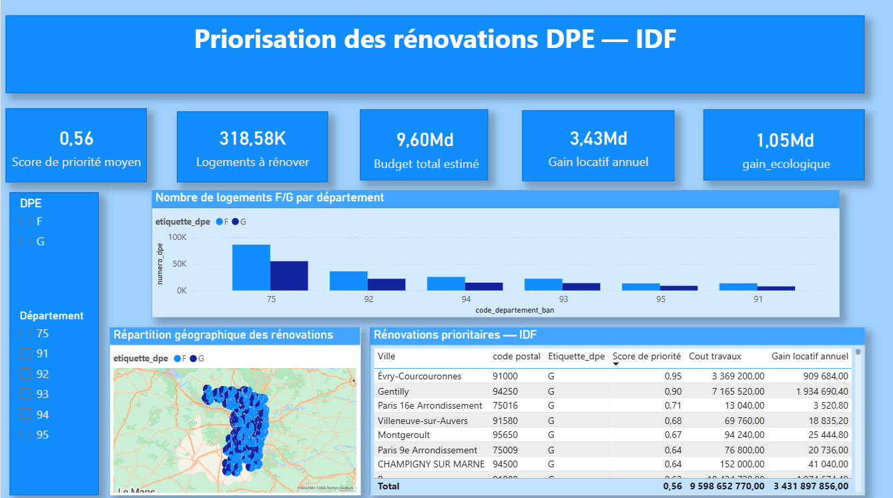

# Priorisation des rénovations énergétiques DPE — Île-de-France

Outil d'aide à la décision pour un bailleur de logements intermédiaires en
Île-de-France, permettant de prioriser les rénovations des logements classés
F et G (DPE) sous contrainte de budget, à partir des données ouvertes ADEME.

> **Statut du document** : ce README distingue explicitement ce qui est
> **vérifié** (issu des scripts SQL réellement exécutés et du fichier
> `.pbix` réel) de ce qui reste **une hypothèse de travail** assumée pour
> les besoins du projet.

---

## 1. Contexte métier

Depuis janvier 2025, un bailleur qui possède un logement classé **G** au DPE
n'a plus la possibilité de le proposer à la location. Il en ira de même pour
les logements classés **F** à partir de 2028 (loi Climat et Résilience).
Pour un bailleur, chaque logement G non rénové est un **actif échoué** : un
bien qui existe dans le patrimoine mais qui ne génère plus aucun revenu
locatif tant que les travaux n'ont pas été réalisés.

La question posée par ce projet est celle d'un responsable data face à un
budget contraint :

> *"On a un budget limité et des milliers de logements F et G répartis sur
> tout le territoire. On ne peut pas tout rénover d'un coup. Quels logements
> rénover en premier pour maximiser le nombre de biens remis sur le marché
> locatif, sans dépasser le budget ?"*

### Grille de lecture des étiquettes DPE

| Étiquette | Consommation (kWh/m²/an) | Situation  |
|---|---|---|
| A | < 70 | — |
| B | 70 – 110 | — |
| C | 110 – 180 | Cible de rénovation retenue dans ce projet |
| D | 180 – 250 | Standard du parc ancien |
| E | 250 – 330 | Début de zone à risque |
| F | 330 – 420 | Les bailleurs ne pourront plus le proposer à la location à partir de 2028 |
| G | > 420 | Les bailleurs ne peuvent plus le proposer à la location depuis janvier 2025 |

---

## 2. Hypothèses de travail (à assumer explicitement)

Le jeu de données ADEME couvre **environ 336 000 logements F/G** en
Île-de-France, un volume nettement supérieur au parc réel d'un bailleur
intermédiaire type (de l'ordre de 80 000 logements toutes classes
confondues). Le projet est donc traité comme un **cas d'usage
méthodologique généralisable**, applicable à n'importe quel bailleur social
ou intermédiaire d'Île-de-France, plutôt que comme l'audit exact d'un
patrimoine précis. Ce point est assumé et doit être présenté comme tel en
entretien plutôt que dissimulé.

Les hypothèses chiffrées utilisées dans les calculs sont les suivantes :

| Paramètre | Valeur retenue | Origine |
|---|---|---|
| Coût de rénovation — logement G | 800 €/m² | Haut de la fourchette documentée pour une rénovation F/G → C/B : 400 à 800 €/m² selon [koutravo.fr](https://www.koutravo.fr/dpe-f-ou-g-quel-budget-prevoir-pour-une-renovation-complete/), 400-700 €/m² pour une rénovation globale performante selon l'ADEME (cité par [blog.moteurimmo.fr](https://blog.moteurimmo.fr/investir-dans-une-passoire-thermique-une-strategie-de-valorisation-durable/)) |
| Coût de rénovation — logement F | 500 €/m² | Milieu de la même fourchette documentée, travaux généralement moins lourds qu'un G |
| Loyer de référence | 18 €/m²/mois | Ordre de grandeur d'un loyer intermédiaire francilien |
| Cible de consommation post-travaux | 150 kWh/m²/an | Proche du seuil de la classe C |
| Valorisation de l'énergie économisée | 0,25 €/kWh | Ordre de grandeur d'un prix moyen de l'électricité/gaz au m² |
| Bonus d'urgence logement G | × 1,5 | Reflète le fait que les bailleurs ne peuvent déjà plus louer ce type de logement (contrainte immédiate, contrairement au F qui a jusqu'en 2028) |

Ces valeurs sont présentées comme des hypothèses de modélisation,
modifiables en un point unique du code (la vue SQL) si des chiffres réels
sont communiqués par une entreprise. À noter en particulier : aucune source
publique consultée ne distingue un coût au m² propre aux logements F d'un
coût propre aux logements G — les fourchettes publiées couvrent les deux
étiquettes ensemble. L'écart retenu ici entre F (500 €/m²) et G (800 €/m²)
est donc une hypothèse de modélisation assumée, cohérente avec le fait
qu'un G nécessite en général des travaux plus lourds, mais pas une valeur
officielle distincte par étiquette.

---

## 3. Stack technique

- **Base de données** : SQL Server Express
- **Préparation des données** : Excel, Power Query (nettoyage initial), SQL (typage, dédoublonnage, vue métier)
- **Visualisation** : Power BI Desktop
- **Langages** : SQL

---

## 4. Architecture du pipeline (ETL)

```
ADEME (données ouvertes DPE, pré-filtrées F/G, IDF)
        │
        ▼
1. EXTRACTION
   Téléchargement du jeu de données brut, pré-filtré F/G sur les
   départements ciblés
        │
        ▼
2. NETTOYAGE INITIAL (Power Query)
   Suppression de certaines colonnes + modifications d'autres colonnes
        │
        ▼
3. CHARGEMENT BROUILLON (SQL Server)
   Table `dpe_donnees_propres` : toutes les colonnes en NVARCHAR,
   pour absorber les données brutes sans erreur de format à l'import
   (générée via l'assistant d'import, non scriptée)
        │
        ▼
4. CRÉATION DE LA TABLE FINALE STRUCTURÉE
   01_creation_base/01_creation_table_finale.sql
   dpe_donnees_propres_final avec les types définitifs
   (DATE, FLOAT, SMALLINT, NVARCHAR)
        │
        ▼
5. TRANSFORMATION + DÉDOUBLONNAGE + INSERTION
   02_nettoyage/01_deduplication_insertion.sql
   - Conversion des types (TRY_CONVERT / TRY_CAST, robuste aux erreurs)
   - Remplacement virgule → point pour les décimaux
   - Dédoublonnage via CTE + ROW_NUMBER() sur numero_dpe
   - Suppression de la table brouillon une fois l'insertion faite
        │
        ▼
6. ANALYSE EXPLORATOIRE (EDA)
   03_analyse_exploratoire/eda_queries.sql
   Répartition F/G, répartition par commune — premier état des lieux
        │
        ▼
7. VUE MÉTIER
   04_calculs_metier/vue_priorite_renovation.sql
   Calcul du coût travaux, gain financier, gain écologique,
   score de priorité (voir section 6)
        │
        ▼
8. DASHBOARD POWER BI
   Connexion en import via la vue uniquement
```

---

## 5. Modèle de données

**Table finale** : `dpe_donnees_propres_final`
**Vue exposée à Power BI** : `vue_priorite_renovation`

| Colonne | Description |
|---|---|
| `numero_dpe` | Identifiant unique du diagnostic (clé primaire) |
| `date_fin_validite_dpe` | Date de fin de validité du DPE |
| `etiquette_dpe` | Étiquette F ou G |
| `type_batiment` | Type de bâtiment (maison, appartement...) |
| `annee_construction` | Année de construction |
| `surface_habitable_logement` | Surface en m² |
| `nom_commune_ban` | Commune du logement |
| `code_postal_ban` | Code postal |
| `code_departement_ban` | Département |
| `conso_5_usages_par_m2_ep` | Consommation énergétique actuelle |
| `cout_total_5_usages` | Coût total des 5 usages énergétiques |
| `cout_travaux` | Coût de rénovation estimé |
| `gain_financier` | Revenu locatif annuel estimé |
| `gain_ecologique_euros` | Économie d'énergie annuelle en € |
| `score_priorite` | Score de priorisation |

---

## 6. Logique métier — le score de priorité

Pour chaque logement, quatre valeurs sont calculées dans
`vue_priorite_renovation` (script complet dans
[`04_calculs_metier/vue_priorite_renovation.sql`](./04_calculs_metier/vue_priorite_renovation.sql)) :

**Coût des travaux**
```
G : surface × 800 €/m²
F : surface × 500 €/m²
```

**Gain financier** (revenu locatif annuel maintenu grâce à la rénovation)
```
surface × 18 €/m² × 12 mois
```

**Gain écologique** (économie d'énergie annuelle, convertie en euros)
```
(consommation actuelle − 150) × surface × 0,25 €/kWh
```

**Score de priorité** (rentabilité pondérée par l'urgence réglementaire)
```
score = ((gain_financier + gain_écologique) × bonus) / coût_travaux

bonus = 1,5 si étiquette G, sinon 1,0
```

### Exemple chiffré

Logement classé G, 50 m², consommation actuelle 450 kWh/m²/an :

| Étape | Calcul | Résultat |
|---|---|---|
| Gain financier | 50 × 18 × 12 | 10 800 € |
| Gain écologique | (450 − 150) × 50 × 0,25 | 3 750 € |
| Coût des travaux | 50 × 800 | 40 000 € |
| Somme des gains × bonus | (10 800 + 3 750) × 1,5 | 21 825 € |
| **Score de priorité** | 21 825 / 40 000 | **0,5456** |

### Pourquoi un bonus pour les logements G plutôt qu'un simple classement par gain écologique

L'économie d'énergie mesure une **quantité** (combien de kWh sont
économisés). Le bonus d'urgence mesure un **délai réglementaire** : pour un
G, le bailleur ne peut déjà plus le remettre en location aujourd'hui, alors
qu'un F peut encore l'être jusqu'en 2028. Sans ce bonus, l'algorithme
pourrait classer un F très énergivore devant un G peu énergivore, alors que
le G génère une perte de loyer immédiate. Le score combine donc trois
dimensions : la rentabilité (gain / coût), l'impact écologique et le bonus.

---

## 7. Dashboard Power BI

Fichier : `Dashboard_Priorisation_Renovations_DPE_IDF.pbix`
Page : *Priorisation rénovations*

### KPI (cartes)

| KPI | Champ | Agrégation |
|---|---|---|
| Logements à rénover | `numero_dpe` | Nombre (valeurs non vides) |
| Budget total estimé | `cout_travaux` | Somme |
| Gain locatif annuel | `gain_financier` | Somme |
| Gain écologique | `gain_ecologique_euros` | Somme |
| Score de priorité moyen | `score_priorite` | Moyenne |

### Filtres

- Segment `etiquette_dpe` (F / G)
- Segment `code_departement_ban`

### Histogramme — *Nombre de logements F/G par département*
Axe X : `code_departement_ban` · Axe Y : nombre de `numero_dpe` ·
Légende : `etiquette_dpe`

### Tableau — *Rénovations prioritaires — IDF*
Colonnes : `nom_commune_ban`, `code_postal_ban`, `etiquette_dpe`,
`score_priorite` (moyenne), `cout_travaux` (somme), `gain_financier` (somme).
Le tri actuellement appliqué porte sur `gain_financier` décroissant, et non
sur `score_priorite` comme prévu initialement dans la conception du
dashboard. Les deux tris ont un sens différent (le premier priorise le
loyer récupéré, le second la rentabilité pondérée par l'urgence) : un seul
doit être retenu consciemment avant la présentation, en cliquant sur
l'en-tête de colonne `Score de priorité` si besoin de changer.

### Carte géographique — *Répartition géographique des rénovations*
Emplacement : `code_postal_ban` · Taille des bulles : nombre de `numero_dpe`
· Légende : `etiquette_dpe`

---
## 7. Aperçu et Démonstration du Dashboard Power BI

Voici un aperçu du dashboard Power BI, illustrant comment les données peuvent être filtrées par département et par étiquette DPE pour adapter l'analyse. 



Pour voir l'outil en action et découvrir son interactivité, cliquez sur le lien ci-dessous pour visionner une courte vidéo de démonstration :

▶️ **[Voir la vidéo de démonstration](./Démonstration_dashboard_dpe.mp4)**

*(Note : Le fichier source Power BI est mis à votre disposition. Vous pouvez télécharger le fichier `Dashboard_Priorisation_Renovations_DPE_IDF.pbix` situé dans le dossier `06_dashboard/` et l'ouvrir avec Power BI Desktop pour explorer vous-même l'outil en local).*


## 8. Sécurité — avant de publier sur GitHub

Le script [`05_securite/creation_login_powerbi.sql`](./05_securite/creation_login_powerbi.sql)
crée un login SQL Server dédié à Power BI, en lecture seule uniquement
(principe du moindre privilège). **Le mot de passe réel utilisé en local a
été remplacé par un placeholder avant intégration à ce dépôt** — ne jamais
committer un mot de passe réel, même pour un projet de portfolio sur une
base locale. Si ton script original contient encore le vrai mot de passe
quelque part, pense à le changer avant de pousser sur GitHub public, et à
ajouter un `.gitignore` si tu stockes des identifiants dans des fichiers
séparés à l'avenir.

---

## 9. Limites et pistes d'amélioration

- **Échelle du jeu de données** non calée sur un patrimoine réel (voir
  section 2)
- **Aucun filtre sur l'état d'occupation ou la date de fin de bail** :
  une vraie feuille de route opérationnelle prioriserait les logements G
  déjà vides ou dont l'état des lieux de sortie est proche, et les
  logements F dont l'échéance 2028 approche. Piste identifiée mais non
  implémentée dans la version actuelle du dashboard, faute de colonne
  disponible dans le jeu de données ADEME.

---

## 10. Structure du dépôt

```
01_creation_base/            Création de la table finale structurée
02_nettoyage/                Typage, dédoublonnage, insertion, purge du brouillon
03_analyse_exploratoire/     Requêtes EDA (répartition F/G, par commune)
04_calculs_metier/           Vue SQL de priorisation (vérifiée, prête à l'emploi)
05_securite/                 Création du login Power BI dédié (lecture seule)
06_dashboard/                Fichier Power BI (.pbix)
README.md                    Ce document
```

---

## 11. Auteur

**Ben-enfane Assoumani**
Étudiant en Master  Statistique et Sciences des Données — Université de Montpellier
Recherche une alternance Data Analyst (12 mois) en M2 Statistique et Sciences des Données — début septembre 2026,
rythme 2 mois entreprise / 2 mois école  (puis 6 mois à temps plein dès mars 2027)

LinkedIn : [@ben-enfaneassoumani](https://linkedin.com/in/ben-enfaneassoumani)
